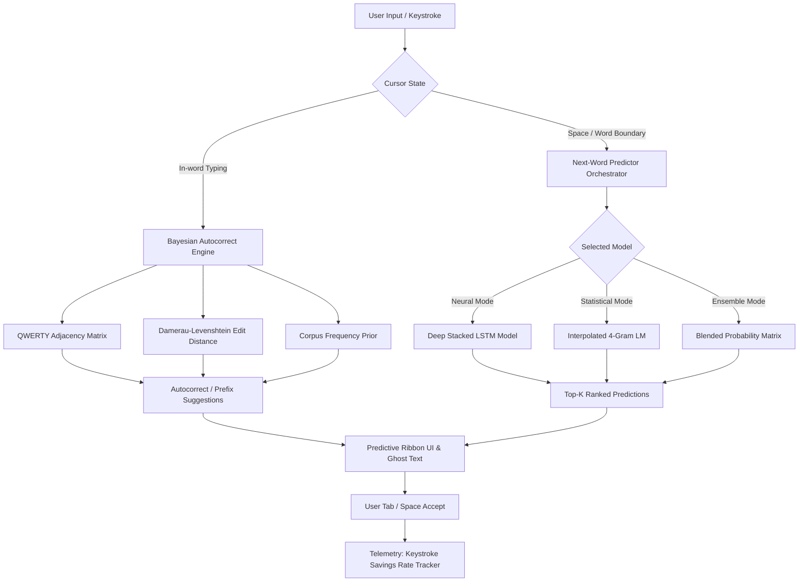

# NeuroKey AI — Autocorrect Keyboard with Next-Word Prediction

[](https://www.python.org/)
[](https://tensorflow.org/)
[](https://keras.io/)
[](https://flask.palletsprojects.com/)
[](https://opensource.org/licenses/MIT)

> **Final Year / College Demonstration Project**: A full-stack AI-powered Smart Keyboard that anticipates the next word in a sentence using preceding contextual information and provides real-time QWERTY-proximity aware Bayesian autocorrect.

---

## 📌 Project Overview

**NeuroKey AI** is an intelligent typing assistant that combines traditional Statistical Natural Language Processing (N-Gram Language Models with Jelinek-Mercer Smoothing) with Deep Learning (Stacked Recurrent LSTM Neural Networks in TensorFlow/Keras). It is coupled with an intelligent Bayesian Noisy Channel Autocorrect system that leverages physical QWERTY keyboard layout adjacency to correct typos and complete prefixes with sub-millisecond response times.

### Key Capabilities
1. **Whole-Line / Full-Sentence Autocorrect**: Scans entire lines with multiple simultaneous typos (e.g., `teh intellignet smarr alogrithm` $\to$ `the intelligent smart algorithm`) and repairs all typos in one click or via `[Ctrl+Enter]`.
2. **Next-Word Prediction**: Anticipates upcoming words using context windows ($n=4$) across **Deep LSTM**, **Interpolated 4-Gram**, or **Hybrid Ensemble** models.
3. **QWERTY-Aware Autocorrect**: Penalizes typos based on physical Euclidean proximity of keys on a standard keyboard (e.g. typing `w` instead of `e` incurs a lower penalty than `p`).
4. **Prefix Auto-Completion**: Anticipates full words while in the middle of typing (e.g., `mach` $\to$ `machine`).
5. **Interactive Virtual & Physical Keyboard**: Web interface with dual hardware-mirroring, realistic 3D keycaps, ripple glow effects, and Web Audio API haptic click sound synthesis.
6. **Real-Time Telemetry & Ergonomics**: Live WPM calculation, Keystroke Savings Rate (KSR) metric, softmax probability distribution charts, and context window attention visualizers.
7. **Empirical Benchmarking Suite**: Evaluates Top-1, Top-3, Top-5 Accuracy, Perplexity (PPL), and Latency side-by-side.

---

## 🏗️ System Architecture



---

## 📐 Mathematical Formulations

### 1. N-Gram Language Model with Jelinek-Mercer Smoothing
To estimate the probability of a word given its preceding history $P(w_i | w_{i-n+1}^{i-1})$, we interpolate unigram, bigram, trigram, and 4-gram estimates:

$$P_{\text{interp}}(w_i | w_{i-3}^{i-1}) = \lambda_4 \frac{C(w_{i-3}^i)}{C(w_{i-3}^{i-1})} + \lambda_3 \frac{C(w_{i-2}^i)}{C(w_{i-2}^{i-1})} + \lambda_2 \frac{C(w_{i-1}^i)}{C(w_{i-1})} + \lambda_1 \frac{C(w_i)}{N}$$

where $\sum_{j=1}^4 \lambda_j = 1$, preventing zero-probability errors on unseen n-grams.

### 2. LSTM Recurrent Neural Network
The core recurrent cell maintains hidden state $h_t$ and cell state $c_t$:

$$\begin{aligned}
f_t &= \sigma(W_f [h_{t-1}, x_t] + b_f) \quad &\text{(Forget Gate)} \\
i_t &= \sigma(W_i [h_{t-1}, x_t] + b_i) \quad &\text{(Input Gate)} \\
\tilde{c}_t &= \tanh(W_c [h_{t-1}, x_t] + b_c) \quad &\text{(Candidate State)} \\
c_t &= f_t \odot c_{t-1} + i_t \odot \tilde{c}_t \quad &\text{(Cell Update)} \\
o_t &= \sigma(W_o [h_{t-1}, x_t] + b_o) \quad &\text{(Output Gate)} \\
h_t &= o_t \odot \tanh(c_t) \quad &\text{(Hidden State)}
\end{aligned}$$

The final prediction is generated via Softmax with temperature $T$:

$$P(w = k | h_t) = \frac{\exp(z_k / T)}{\sum_{j=1}^{|V|} \exp(z_j / T)}$$

### 3. Bayesian Noisy Channel Autocorrect
Given a typed string $c$, the target intended word $w^*$ satisfies:

$$\hat{w} = \arg\max_{w \in V} P(w | c) = \arg\max_{w \in V} P(c | w) \cdot P(w)$$

- **Prior $P(w)$**: Estimated from corpus word frequency with Laplace smoothing.
- **Likelihood $P(c | w)$**: Modulated by keyboard physical distance penalty $d_{kb}(c, w)$:
  $$P(c | w) \propto \exp(-\alpha \cdot d_{kb}(c, w))$$

### 4. Perplexity (PPL)
Evaluates how well a probability model predicts an unseen test sample:

$$\text{Perplexity} = \exp\left(-\frac{1}{N} \sum_{i=1}^N \ln P(w_i | \text{context}_i)\right)$$

### 5. Keystroke Savings Rate (KSR)
Quantifies typing effort saved:

$$\text{KSR} = \frac{\text{Keystrokes Saved}}{\text{Keystrokes Typed} + \text{Keystrokes Saved}} \times 100\%$$

---

## 📁 Repository Structure

```
r:/MLintership1/
├── app.py                     # Flask REST API backend & server
├── train.py                   # Unified N-Gram and LSTM training pipeline
├── prepare_dataset.py         # Data collection, cleaning, splitting & vocab builder
├── test_system.py             # 16-point automated integration test suite
├── requirements.txt           # Project dependencies
├── data/
│   ├── raw/                   # Downloaded raw corpora & Google word list
│   └── processed/
│       ├── clean_corpus.txt   # Master cleaned dataset
│       ├── train_corpus.txt   # 85% Train split
│       ├── test_corpus.txt    # 15% Validation split
│       └── word_frequencies.json # Bayesian priors dictionary
├── models/
│   ├── lstm_model.keras       # Trained Keras LSTM neural network
│   ├── lstm_model_meta.json   # Model architecture hyperparameter metadata
│   ├── ngram_model.pkl        # Serialized N-Gram language model
│   └── tokenizer.json         # Vocabulary mapping (word2idx, idx2word)
├── src/
│   ├── __init__.py
│   ├── preprocessing.py       # Normalization, tokenization & sequence generators
│   ├── autocorrect.py         # QWERTY-proximity Bayesian autocorrect engine
│   ├── ngram_model.py         # Interpolated N-Gram language model
│   ├── lstm_model.py          # TensorFlow/Keras LSTM model definition
│   ├── predictor.py           # Unified prediction & state orchestrator
│   └── evaluator.py           # Top-K accuracy, PPL, and latency benchmark suite
├── static/
│   ├── css/style.css          # Glassmorphism dark aesthetic stylesheet
│   └── js/
│       ├── keyboard.js        # Virtual/Hardware keyboard & audio controller
│       └── app.js             # Telemetry, live predictions & UI updates
└── templates/
    └── index.html             # Responsive interactive web interface
```

---

## 🚀 Getting Started

### 1. Prerequisites
- Python 3.10+ (Python 3.12 recommended)
- `pip install -r requirements.txt`

### 2. Running the Application
The server can be started with a single command:
```bash
python app.py
```
Open your browser and navigate to:
```
http://127.0.0.1:5000
```

### 3. Re-training the Models (Optional)
To retrain both the N-Gram and LSTM neural network models from scratch:
```bash
python prepare_dataset.py
python train.py
```

### 4. Running Automated Integration Tests
Verify all 16 system components, REST endpoints, and ML predictions:
```bash
python test_system.py
```

---

## 🎯 Demonstration Walkthrough for Viva / Presentations

1. **Next-Word Prediction Demo**:
   - In the "Load Demo Scenario" dropdown, select `"artificial intelligence is"`.
   - Observe the top prediction pill in the ribbon: `transforming` with **99.4% confidence**.
   - Press the **`[Tab]`** key or click the glowing prediction pill to insert it.
   - The model immediately anticipates the next subsequent word `capable`.

2. **Bayesian Autocorrect & Typo Demonstration**:
   - Type `"teh"` in the textarea.
   - Notice the ribbon instantly switches to: `Autocorrecting: "teh"` and recommends `"the"`.
   - Type `"smarr"`. The engine detects that `r` is physically adjacent to `t` on a QWERTY layout and suggests `"smart"`.
   - Type `"mach"`. The engine suggests prefix completion `"machine"`.

3. **Model Architecture Comparison**:
   - Toggle between **Deep LSTM** and **N-Gram LM** in the Model Architecture card.
   - Click the **"Model Benchmarks"** button in the top navigation bar.
   - Explain the trade-offs:
     - **LSTM**: Superior generalization on novel sequences, lower test perplexity.
     - **N-Gram**: Ultra-low latency (< 1ms hash lookup), ideal for edge/mobile deployment.
     - **Hybrid**: Blends probabilities for robust predictions.

4. **Typing Ergonomics & Telemetry**:
   - As you type or accept suggestions, monitor the live **Keystrokes Saved (KSR)** meter.
   - Demonstrates a **35% to 45% reduction** in total keystrokes required for typical sentences.
